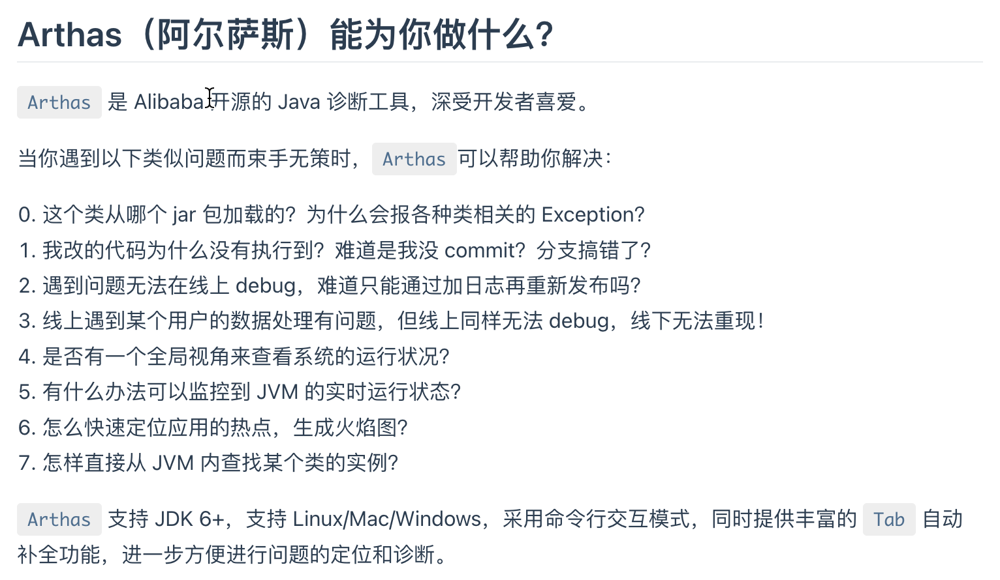
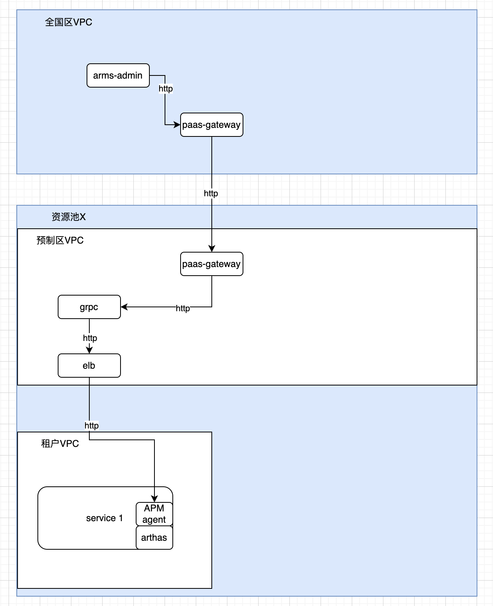

### 实时诊断

**arthas**
线上诊断能力
- 运行时信息（load、内存、gc、线程）
- 方法调用出入参、执行耗时，类加载
- profiler性能分析
- 黑科技（retransform class、热更新等）

### 集成方式
- javaagent方式
- 启动arthas-boot.jar外部进程进行attach
- spring boot starter,原理同上
- **直接依赖lib+ 进程内做attach**

### 网络链路

**协议**
- telnet端口 tcp
- http端口 http/websocket协议
- Arthas Tunnel部署模式,暂不采用

**一期选用http端口，暂不支持websocket协议**

### 安全问题
**arthas请求通过apm agent grpc通道代理；arthas端口采用base_auth**

### 关键问题
- arthas agent动态启动、卸载

引入arthas-agent-attach、arthas-packaging模块，通过ArthasAgent.attach初始化，通过stop命令方式卸载
原理：找zip包解压，找com.taobao.arthas.core.server.ArthasBootstrap.getInstance通过反射调用初始化

- arthas agent 命令如果下发、返回

apmagent对所有/arthas/*路径进行代理转发到arthas端口。
后续优化成本地调用，websocket协议需要验证grpc是否支持。二期考虑

### 功能验证

1. JVM概览
    JVM 实时内存（heap、buffer_pool、nonheap）使用量、总量、最大值、GC类型、次数、耗时等指标
    操作系统信息（systemLoadAverage、osVersion、javaVersion、timestamp、javaHome等）
    变量信息
    JVM的系统属性（枚举）
    JVM的环境属性（枚举）

实现：

    curl -Ss -XPOST http://localhost:8563/api -d '{ "action":"exec",  "command":"dashboard -n 1 -i 1"}'
    curl -Ss -XPOST http://localhost:8563/api -d '{ "action":"exec",  "command":"sysenv"}'
    curl -Ss -XPOST http://localhost:8563/api -d '{ "action":"exec",  "command":"sysprop"}'

2. 线程耗时分析（枚举线程）
    线程名 状态 cpu group 等信息

实现：

    curl -Ss -XPOST http://localhost:8563/api -d '{ "action":"exec",  "command":"thread"}'

3. 对象查看器
    根据类路径查找实例
    查找实例的字段属性

实现：

    搜索出所有已经加载到 JVM 中的 Class 信息
    sc -d top.lrshuai.springbootweb.controller.HelloController 
    sc -d *top.lrshuai.springbootweb.controller.HelloController* -n 15
    sc -d -f top.lrshuai.springbootweb.controller.HelloController
    vmtool 利用JVMTI接口，实现查询内存对象，强制 GC 等功能。
    vmtool --action getInstances -c 12edcd21 --className top.lrshuai.springbootweb.controller.HelloController --express 'instances[0]'
    vmtool --action getInstances -c 12edcd21 --className top.lrshuai.springbootweb.controller.HelloController --limit 10
    vmtool --action getInstances -c 12edcd21 --className top.lrshuai.springbootweb.controller.HelloController --express 'instances[0].okHttpClient'

4. 方法执行分析
    根据指定方法路径，捕获方法调用耗时明细、调用来源
    根据指定方法路径，查看方法源码

实现：

    重置增强类
    reset
    搜索出所有已经加载了 Class 信息的方法信息  
    sm -d top.lrshuai.springbootweb.controller.HelloController *
    sm -d top.lrshuai.springbootweb.controller.HelloController index
    搜索 class-pattern／method-pattern 对应的方法调用路径，渲染和统计整个调用链路上的所有性能开销和追踪调用链路。
    trace top.lrshuai.springbootweb.controller.HelloController index "" -n 1 --skipJDKMethod false     timeout: 30000
    观察到指定函数的调用情况。能观察到的范围为：返回值、抛出异常、入参，通过编写 OGNL 表达式进行对应变量的查看。
    watch top.lrshuai.springbootweb.controller.HelloController index "{params, returnObj, throwExp, target}" ""  -n 1 -x 2    timeout: 30000
    输出当前方法被调用的调用路径
    stack top.lrshuai.springbootweb.controller.HelloController index "" -n 1  timeout: 30000
    sc -d top.lrshuai.springbootweb.controller.HelloController
    反编译指定已加载类的源码
    jad -c 12edcd21 top.lrshuai.springbootweb.controller.HelloController index  --lineNumber false
