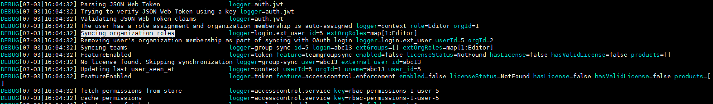

# grafana 集成

## 身份验证
* 匿名访问 
```
[auth.anonymous]
# enable anonymous access
enabled = true
org_name = Main Org.

[security]
allow_embedding = true
```
* service accounts/api keys
1. 通用接口或者界面创建service accounts（属于某个组织，不能跨组织。社区版不支持RBAC）
2. 给service accounts创建tokens
* OAuth身份验证
1. 确认OAuth身份认证服务类型，官方已集成

* jwt
1. 生成JWKS
2. 修改grafana配置，启动
3. 测试

4. 限制
https://github.com/grafana/grafana/discussions/39102
https://github.com/grafana/grafana/issues/16763
https://grafana.com/docs/grafana/latest/setup-grafana/configure-security/configure-team-sync/
```
curl 
GET /api/orgs/1 HTTP/1.1
Accept: application/json
Content-Type: application/json

curl -X POST -H "Content-Type: application/json" -d '{"name":"New Org."}' <URL>

POST /api/orgs HTTP/1.1
Accept: application/json
Content-Type: application/json

{
  "name":"New Org."
}

```

```
curl -X POST -H "Content-Type: application/json" -d '{"loginOrEmail":"user","role":"Viewer"}' 

POST /api/admin/users HTTP/1.1
Accept: application/json
Content-Type: application/json

{
  "name":"User",
  "email":"user@graf.com",
  "login":"user",
  "password":"userpassword",
  "role":"Viewer",
  "OrgId": 3
}


```


* cookie
1. 模拟登录，获取grafana_session
2. 创建用户

* auth代理
1. 
## 数据源集成
* 代理

* 数据源插件