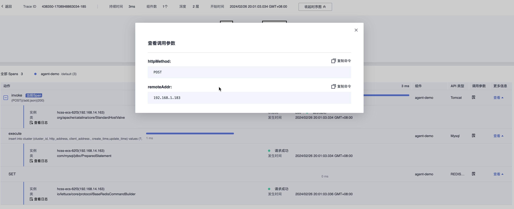
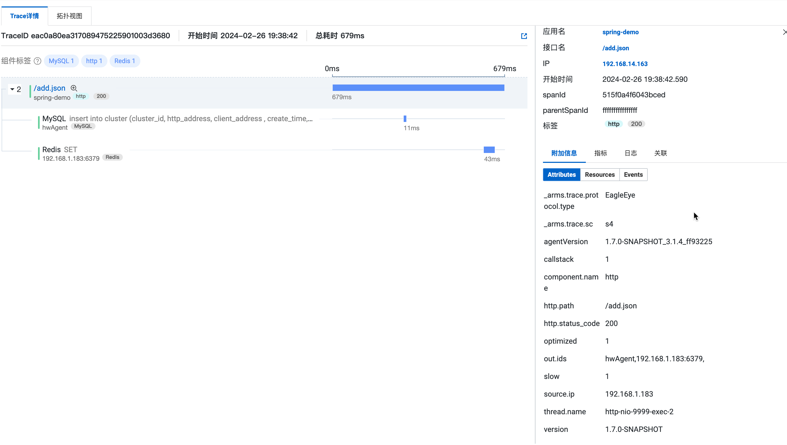
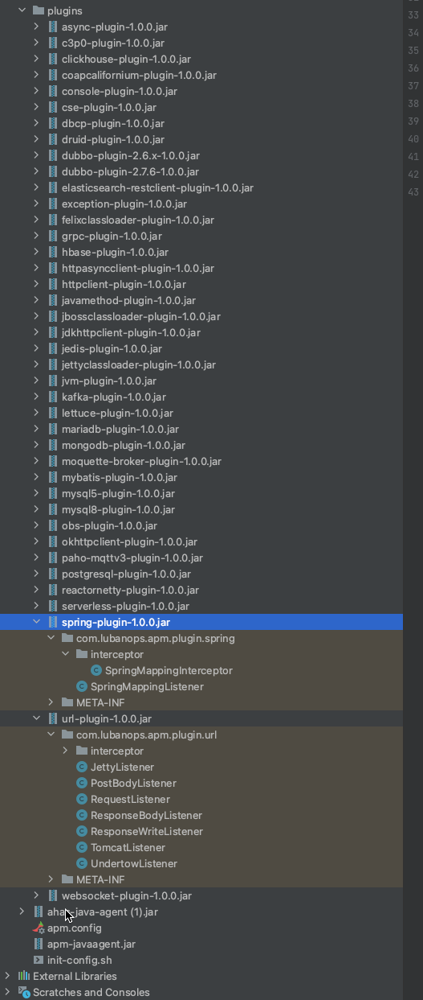
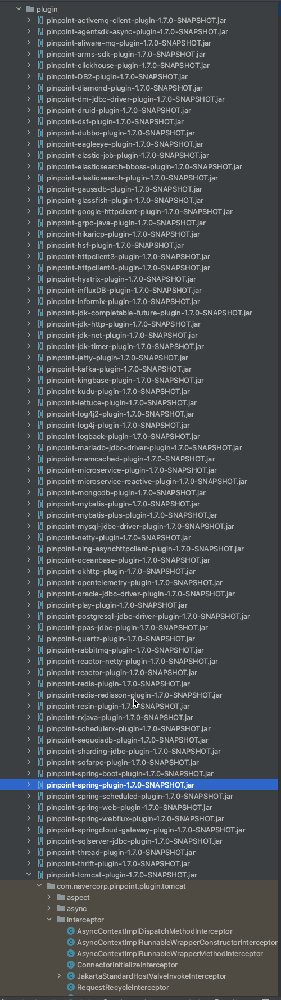

apm agent 
开发依赖底层技术：Javaagent、JVMTI技术、classloader、字节码增强、SPI
关键技术点：javaagent启动流程、classerloader加载、插件加载、transform工作流、context管理与传递

agent开发设计到JVMTI、 classloader、字节码增强、大量三方框架的插桩等技术，前期开发曲线比较陡峭，且不好测试及debug，对稳定性有挑战和技术有更高要求。

主流APM Java agent的开发核心流程大同小异，都采取 -javaagent:/path/agent.jar参数在应用启动时挂载agent，通过自定义的classLoader加载core包和plugin包，定义transform工作流，对需要插桩的方法进行增强，核心模块负责context管理，span管理与传递，pinpoint和skywalking采用的方式都是一样的 字节码开发工具都采用ByteBuddy进行处理，plugin的加载都是采用SPI的动态加载机制，各个组件定义的agent启动工作流、协议、transform流程、协议、插桩类方法有差异。

1、二次开发

OpenTelemetry agent 中
使用Gradle来进行依赖管理，配置用的是Kotlin、GroovyDSL脚本文件，整个java agent会被打包成一个java agent文件，前期工程代码熟悉的成本较高，扩展方便。采用sdk与Java Agent分离的架构，使用了较多的开源库。CNCF项目，目前迭代活跃

SkyWalking agent 低
maven工程，模块划分较清晰直接，扩展方便。老牌国产APM开源软件，apache项目，国内口碑较好，生态较完善。

2、性能

测试结果
https://docs.qq.com/doc/DR3dVeWZpdWVQV3Nj?code=Y8eNE_v78nYwlsIBJ3u4BoZJZw3a3jLmvqV5hhUufNs&state=weworklogin

| 基线	| 华为Agent |	skywalking |	opentelemetry	| 阿里Agent |
| -- | ------------- | ------------- | ----- | ------ |
| 500QPS	| 11.3% |	12.5%	| 13.3%	| 15.0%	| 16.7% |
| 1000QPS	| 20% |	21.5%	| 21.5%	| 24.7%	| 27.5% |

从测试结果上看阿里arms agent和OpenTelemetry agent性能损耗较SkyWalking、华为应用性能监控agent高。
阿里arms agent是基于pinpoint二次开发，从span结果上看pinpoint、OpenTelemetry采集到的属性标签更丰富，需要插桩的代码可能会更多，对于性能损耗会更大

3、扩展
都能覆盖主流的三方库，SkyWalking和OpenTelemetry都预留插件及服务的扩展，扩展较方便。SkyWalking国产开源，插件方便对国内软件适配会更好（druid、rocketMQ、nacos等）

4、生态
OpenTelemetry CNCF项目，整合了metric、trace、log协议规范，已成为标准协议。
SkyWalking apache项目，使用自有协议传输，collect兼容OpenTelemetry等主流agent协议。

| type |  传输协议 |
| -- | ------------- |
| OpenTelemetry | 	使用 traceparent Header 传递 Trace， w3c 协议| 
| SkyWalking	| 使用 sw8 Header 传递 Trace| 
| Jaeger	| 使用 Uber-Trace-Id Header 传递 Trace| 
| Zipkin	| 使用 x-b3-xxx Header 传递 Trace| 

| type | SkyWalking |	OpenTelemetry |
| -- | ------------- | ------------- |
| 数据结构 |	Span -> Segment -> Trace |	Span -> Trace |
| 属性信息 |	Tags |	Attributes |
| 应用事件 |	Logs |	Events |
| 引用关系 |	References |	Links |

**汇总**

| type | OpenTelemetry agent | SkyWalking agent | 华为agent | 阿里agent |
| -- | ------------- | ------------- | ----- | ------ |
| 二次开发 | 前期较高 |  低  | ----- | ------ |
| 性能损耗 | 一般 | 低 | 低 | 一般 |
| 扩展及插件支持 | 高 | 高,国产开源组件适配度高 | ----- | ------ |
| 生态友好 | 高 | 一般 |  ----- | ------ |