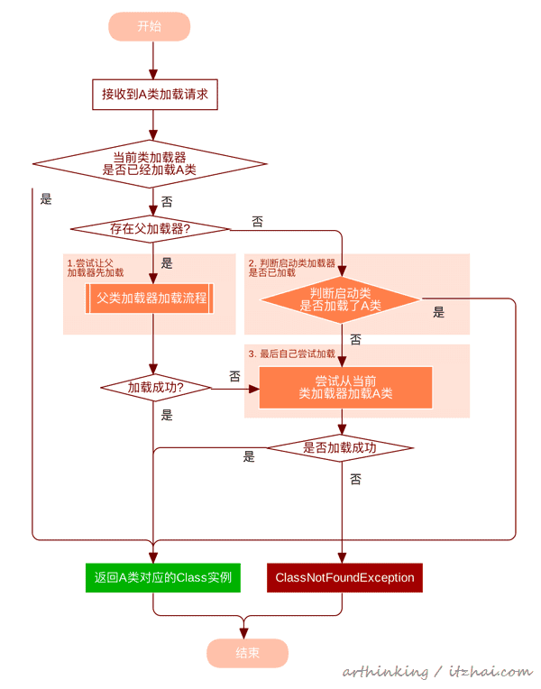
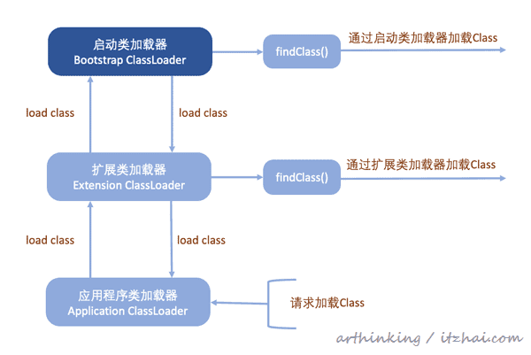
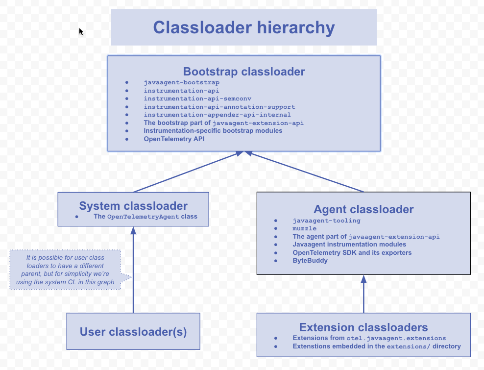
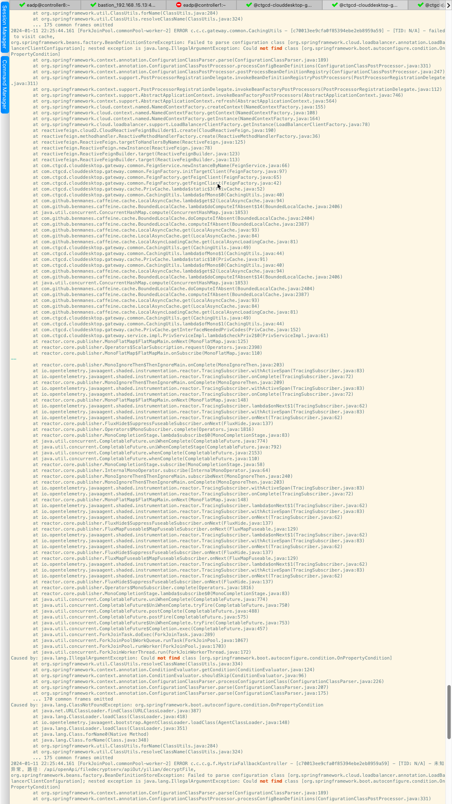

### 类加载
每个ClassLoader都只能加载自己所绑定目录下的资源

### 双亲委派

### 类加载器选择
加载资源时的ClassLoader可以有多种选择：
 1. 系统类加载器SystemClassLoader，可通过ClassLoader.getSystemClassLoader()
 2. 当前ClassLoader：加载了当前类的ClassLoader
 3. 线程上下文类加载器ContextClassLoader：Thread.currentThread().getContextClassLoader() （默认取父线程context classloader）
 4. 自定义类加载器

### 线程contextClassLoader
一些第三方类库，可能被任何的ClassLoader加载，所以最灵活的方式是直接使用上下文类加载器。

### spring jar包加载
https://juejin.cn/post/7066401642412769310

### opentelemetry java agent加载

https://github.com/open-telemetry/opentelemetry-java-instrumentation/blob/main/docs/contributing/javaagent-structure.md

### forkjoin 线程池问题
公用forkjoin thread pool 导致线程ContextClassLoader的不同
### feign classloader 问题
https://github.com/spring-cloud/spring-cloud-commons/pull/1256

