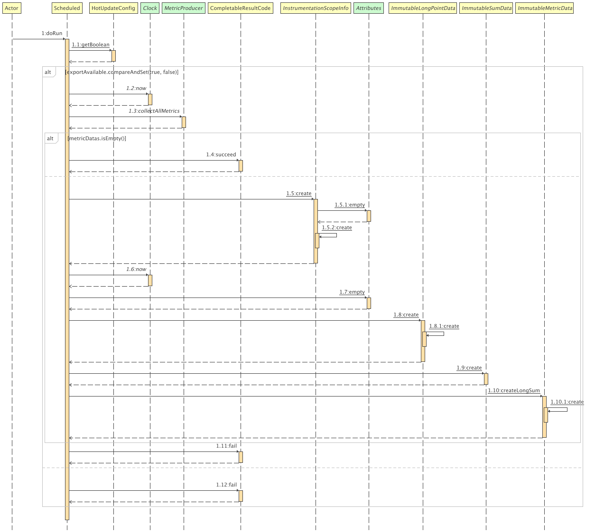

### otel指标集成规范

#### 采集方式分类
- event聚合
原始span数据，例如：当个请求、异常事件

- 直接采集
已有指标源可直接采集，例如：jvm MXBean、system proc、pool metric

#### 集成方式

- api
MeterProvider 是 API 的入口点。它提供对 Meters 的访问

Meter 负责创建 Instruments 

Instruments负责报告测量结果

```
+-- MeterProvider(default)
    |
    +-- Meter(name='io.opentelemetry.runtime', version='1.0.0')
    |   |
    |   +-- Instrument<Asynchronous Gauge, int>(name='cpython.gc', attributes=['generation'], unit='kB')
    |   |
    |   +-- instruments...
    |
    +-- Meter(name='io.opentelemetry.contrib.mongodb.client', version='2.3.0')
        |
        +-- Instrument<Counter, int>(name='client.exception', attributes=['type'], unit='1')
        |
        +-- Instrument<Histogram, double>(name='client.duration', attributes=['server.address', 'server.port'], unit='ms')
        |
        +-- instruments...

+-- MeterProvider(custom)
    |
    +-- Meter(name='bank.payment', version='23.3.5')
        |
        +-- instruments...
```

- 时序图


#### metric exporter
MetricExporter 指标导出器
MetricReader 定期指标读取器
MetricProducer 指标生产者
MetricFilter 指标过滤器
PeriodicMetricReader


```
+-----------------+            +---------------------------------+
|                 | Metrics... |                                 |
| In-memory state +------------> Periodic exporting MetricReader |
|                 |            |                                 |
+-----------------+            |    +-----------------------+    |
                               |    |                       |    |
                               |    | MetricExporter (push) +-------> Another process
                               |    |                       |    |
                               |    +-----------------------+    |
                               |                                 |
                               +---------------------------------+
```

```
       +--------+ +--------+     +--------+
Batch: | Metric | | Metric | ... | Metric |
       +---+----+ +--------+     +--------+
           |
           +--> name, unit, description, meter information, ...
           |
           |                  +-------------+ +-------------+     +-------------+
           +--> MetricPoints: | MetricPoint | | MetricPoint | ... | MetricPoint |
                              +-----+-------+ +-------------+     +-------------+
                                    |
                                    +--> timestamps, attributes, value (or buckets), exemplars, ...
```

#### 举个例子-dbcp pool metric 

- 埋点

注册组件
```
@AutoService(InstrumentationModule.class)
public class ApacheDbcpInstrumentationModule extends InstrumentationModule {
  public ApacheDbcpInstrumentationModule() {
    super("apache-dbcp", "apache-dbcp-2.0");
  }

  @Override
  public List<TypeInstrumentation> typeInstrumentations() {
    return singletonList(new BasicDataSourceInstrumentation());
  }
}
```
织入切面
```
class BasicDataSourceInstrumentation implements TypeInstrumentation {
  @Override
  public ElementMatcher<TypeDescription> typeMatcher() {
    return named("org.apache.commons.dbcp2.BasicDataSource");
  }

  @Override
  public void transform(TypeTransformer typeTransformer) {
    typeTransformer.applyAdviceToMethod(
        isPublic().and(named("preRegister")).and(takesArguments(2)),
        this.getClass().getName() + "$PreRegisterAdvice");

    typeTransformer.applyAdviceToMethod(
        isPublic().and(named("postDeregister")),
        this.getClass().getName() + "$PostDeregisterAdvice");
  }

  @SuppressWarnings("unused")
  public static class PreRegisterAdvice {
    @Advice.OnMethodExit(suppress = Throwable.class)
    public static void onExit(
        @Advice.This BasicDataSource dataSource, @Advice.Return ObjectName objectName) {
      String dataSourceName;
      if (objectName != null) {
        dataSourceName = objectName.getKeyProperty("name");
        if (dataSourceName == null) {
          dataSourceName = objectName.toString();
        }
      } else {
        // fallback just in case it is somehow registered without a name
        dataSourceName = "dbcp2-" + System.identityHashCode(dataSource);
      }
      telemetry().registerMetrics(dataSource, dataSourceName);
    }
  }

  @SuppressWarnings("unused")
  public static class PostDeregisterAdvice {
    @Advice.OnMethodExit(suppress = Throwable.class)
    public static void onExit(@Advice.This BasicDataSource dataSource) {
      telemetry().unregisterMetrics(dataSource);
    }
  }
}

```

注册具体采集
```
public final class ApacheDbcpTelemetry {

  /** Returns a new {@link ApacheDbcpTelemetry} configured with the given {@link OpenTelemetry}. */
  public static ApacheDbcpTelemetry create(OpenTelemetry openTelemetry) {
    return new ApacheDbcpTelemetry(openTelemetry);
  }

  private final OpenTelemetry openTelemetry;

  private ApacheDbcpTelemetry(OpenTelemetry openTelemetry) {
    this.openTelemetry = openTelemetry;
  }

  /** Start collecting metrics for given connection pool. */
  public void registerMetrics(BasicDataSourceMXBean dataSource, String dataSourceName) {
    DataSourceMetrics.registerMetrics(openTelemetry, dataSource, dataSourceName);
  }

  /** Stop collecting metrics for given connection pool. */
  public void unregisterMetrics(BasicDataSourceMXBean dataSource) {
    DataSourceMetrics.unregisterMetrics(dataSource);
  }
}

```

```
final class DataSourceMetrics {
  private static final String INSTRUMENTATION_NAME = "io.opentelemetry.apache-dbcp-2.0";

  // a weak map does not make sense here because each Meter holds a reference to the dataSource
  // all instrumented/known implementations of BasicDataSourceMXBean do not implement
  // equals()/hashCode(), so it's safe to keep them in a plain ConcurrentHashMap
  private static final Map<BasicDataSourceMXBean, BatchCallback> dataSourceMetrics =
      new ConcurrentHashMap<>();

  public static void registerMetrics(
      OpenTelemetry openTelemetry, BasicDataSourceMXBean dataSource, String dataSourceName) {
    DbConnectionPoolMetrics metrics =
        DbConnectionPoolMetrics.create(openTelemetry, INSTRUMENTATION_NAME, dataSourceName);

    ObservableLongMeasurement connections = metrics.connections();
    ObservableLongMeasurement minIdleConnections = metrics.minIdleConnections();
    ObservableLongMeasurement maxIdleConnections = metrics.maxIdleConnections();
    ObservableLongMeasurement maxConnections = metrics.maxConnections();

    Attributes attributes = metrics.getAttributes();
    Attributes usedConnectionsAttributes = metrics.getUsedConnectionsAttributes();
    Attributes idleConnectionsAttributes = metrics.getIdleConnectionsAttributes();

    BatchCallback callback =
        metrics.batchCallback(
            () -> {
              connections.record(dataSource.getNumActive(), usedConnectionsAttributes);
              connections.record(dataSource.getNumIdle(), idleConnectionsAttributes);
              minIdleConnections.record(dataSource.getMinIdle(), attributes);
              maxIdleConnections.record(dataSource.getMaxIdle(), attributes);
              maxConnections.record(dataSource.getMaxTotal(), attributes);
            },
            connections,
            minIdleConnections,
            maxIdleConnections,
            maxConnections);

    dataSourceMetrics.put(dataSource, callback);
  }

  public static void unregisterMetrics(BasicDataSourceMXBean dataSource) {
    BatchCallback callback = dataSourceMetrics.remove(dataSource);
    if (callback != null) {
      callback.close();
    }
  }

  private DataSourceMetrics() {}
}
```