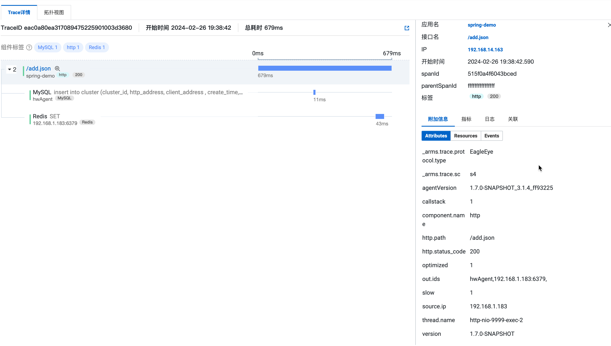

### 技术依赖
Javaagent、Gradle、classloader、SPI、

### Opentelemetry Java 项目结构

- OpenTelemetry Java SDK https://github.com/open-telemetry/opentelemetry-java OJI 实现非侵入式的 Java 探针，SDK 项目基于 OJI 上提供了manual手动创建链路的能力，这种能力通过 OpenTelemetry API、SDK 方式实现的。
- OpenTelemetry Java Contrib https://github.com/open-telemetry/opentelemetry-java-contrib Contrib 给 Java 探针贡献了额外第三方库，目前 Contrib 主要提供一些库。
- Opentelemetry Java https://github.com/open-telemetry/opentelemetry-java-instrumentation Java 探针核心项目

OJI、SDK、Contrib 项目的关系

### 主要模块
- docs帮助介绍文档
- benchmark-overhead压力测试工具
- custom-checks源代码格式规范检查
- javaagent javaagent 核心实现
- javaagent-bootstrap Bootstrap classloader 核心实现 
- instrumentation这里开发自己组件的地方 
- muzzle涉及安全字节码增强和类加载的控制

### 编译部署、运行
OJI 使用Gradle来进行依赖管理，配置用的是 Kotlin DSL 脚本文件
- Groovy DSL 脚本文件使用.gradle 文件扩展名
- Kotlin DSL 脚本文件使用.gradle.kts 文件扩展名
### 主要原理
1. Javaagent启动
- JVMTI技术，启动加载、运行时

Classloader 先去加载 Bootstrap 下的类。
初始化我们 Instrument , 这里面包含我们开发第三方组件探针服务。
通过 AgentInitializer.initialize 去调用 ClassLoader 加载 AgentStarterImpl 类，它是启动 Agent 的核心实现。
2. classerloader机制

3. Instrument Module模块加载
- spi @AutoService注册动态生成spi class
- SafeServiceLoader 加载serviceClass
- AgentStarterImpl 通过ExtensionClassLoader和AgentInstaller.installBytebuddyAgent加载InstrumentationModule
4. Instrumentation Module模块扩展
- 继承InstrumentationModule @AutoService
- 继承TypeInstrumentation实现对特定类和方法的增强
- 编译部署

5. context传递 跨线程 跨进程

6. config配置

7. 组件支持

8. 埋点抑制

9. trace协议支持
阿里ARMS探针会自动识别当前环境使用的链路透传协议，如果当前链路中没有使用任何协议，则默认使用ARMS自身的链路透传协议。
此处以A>B>C场景为例，A、B、C分别是不同的应用，在收到一个请求时会依次查找当前请求是否存在ARMS、Jaeger、ZipKin、Skywalking、OpenTelemetry的协议头，如果存在某一个协议头，则使用该协议，如果一个都不存在，则默认使用ARMS的链路透传协议透传上下文。

华为
#### 选型

| type | OpenTelemetry agent | SkyWalking agent |
| 社区生态 | ------------- | ------------- | 
| 核心能力 | ------------- | ------------- | 
| 协议 | ------------- | ------------- | 
| 开发成本 | ------------- | ------------- | 

相同点: Java agent的开发大同小异的，都采取 -javaagent:/path/agent.jar 加载agent，然后新建classLoader加载core包和plugin包，再使用 webapp-classloader 进行加载，能够在plugin中使用Spring/SpringBoot的classloader，pinpoint和skywalking采用的方式都是一样的 字节码开发工具都采用ByteBuddy 进行处理，plugin的加载基本都是采用SPI的动态记载机制

差异：
阿里云ARMS Java agent: 修改了开源项目 pinpoint 整合而来，加上了 arthas、sentinel、nacos等阿里自家组件, 加上了端上聚合的能力（pinpoint- profile.jar/GeneralDataWorkHandler）。协议私有，支持多种协议透传 
华为云应用监控Java agent: 自研工程名lubanops，插件较少（国内使用主流三方包支持），具备端上聚合能力，指标上报周期1分钟(lubanops-apm-javaagent-bootstrap.jar/TransactionCollector)，延迟较阿里高。插件中定义搜集指标、聚合指标
SkyWalking agent：从工程和代码结构上说二次开发成本更低，扩展性较好，生态友好。
OpenTelemetry agent：Gradle脚本管理项目依赖及编译，编译过程复杂，有较多动态生成文件，最终会打包成一个jar包，体积较少，协议友好、扩展性好。

云厂商和开源agent在端上的传输协议并不相同，阿里云ARMS Java agent对开源agent协议做了端上适配，其他agent未看到有这种处理。针对开源APM agent协议的做法，华为和阿里均在后端collect中做了协议的兼容处理。
默认埋点采集的信息过于详细可能会对性能损耗有影响，pinpoint、OpenTelemetry采集的埋点较多，SkyWalking、华为agent采集信息适中，性能损耗相对小点
agent二次开发主要关注（配置管理、聚合能力、agent上报通道、性能分析适配、插件适配、采样等优化） 

华为agent

sprn 属性较少，ScheduledThreadPoolExecutor定时任务1分钟统计上报

阿里agent

agent开发设计到JVMTI、 classloader、SPI等底层技术，前期开发曲线比较陡峭，且不好测试及debug，对稳定性和开发人员的技术要求会更高。

一、背景：
1、 自主可控、稳定性优先
2、 按需引入插件，扩展插件(开源组件支持都较好，插件都可动态插拔、易扩展，有些服务不好扩展)
3、 性能对齐友商

二、选型因素
1、代码简洁、易懂
  -- 更快的上手
  -- 更快速定位问题
2、性能更优
  -- 默认追踪粒度适中
3、开源社区活跃
  -- 三方插件丰富，提升插件的开发适配效率
  -- 官方中文社区群组，沟通方便，缩短bug的解决时间
4、扩展性
  -- 插件扩展方便
  -- 聚合、配置、上报通道等扩展服务方便

  -- opentelemetry-javaagent
  -- 实现方式：基于Java Agent、class loader、SPI等技术实现的自动生成捕获遥测数据的Java代理。主要模块有javaagent javaagent 核心实现；javaagent-bootstrap Bootstrap classloader 核心实现；instrumentation 插件；muzzle涉及安全字节码增强和类加载的控制； 
  -- 优点：OpenTelemetry整合了metric、trace、log协议规范，已成为标准协议。CNCF项目，项目迭代活跃
  -- 缺点：国内大公司使用较少、整体工程架构较复杂，编译过程较复杂，模块划分较多，采用sdk与Java Agent分离的架构，使用Gradle来进行依赖管理，配置用的是Groovy DSL、Kotlin DSL 脚本文件、前期工程代码熟悉的成本可能较高
  -- 性能：国内关于插件使用的性能问题反馈较少（使用较少），目前已知测试在reactor插件下有较大的性能损耗