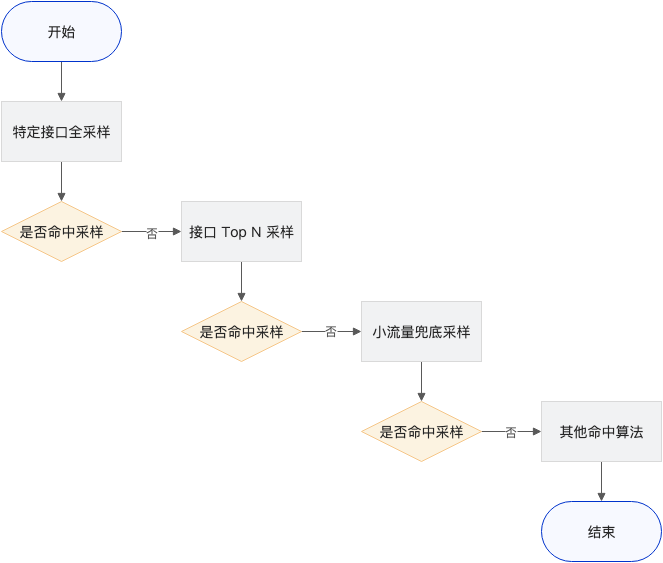

### 采样

#### 目的
平衡快速定位（具体、明细问题）根因效率和成本
 
#### 采样时机
按照采样时机分类

- 头部采样：Head-based sampling
- 尾部采样：Tail-based sampling
- 单元采样：Unitary sampling

头部采样

【原理】这种采样策略是在入口服务接收到请求时决定整条链路是否保留，这个标记会随着链路 context，被透传到链路下游的所有相关服务。对于标记不保留的链路，所有对应的 Span 会在客户端被丢弃，不会上报。

【优势】采样发生在客户端，可以显著降低挂载在业务服务器上的代理对业务服务器资源（网络 I/O 的开销）；同时因为 Span 直接被丢弃，也降低了服务端的存储和计算开销。

【劣势】采样实施在链路产生初期，命中异常和慢响应的几率低，会影响故障排查。

【增强】配合异常回溯上报，即每个链路节点服务在上报代理处缓存窗口期内的 Span 信息，下游链路出现异常后，可以动态扭转上游链路的采样状态，保证完整异常链路留存。当然这种缓存机制，相应也会对业务服务器产生较大的内存开销。如果不处理上游的旁支链路，可以消除缓存机制。

尾部采样

【原理】这种采样策略是在请求处理完成时决定整条链路是否保留。客户端会将所有 Span 都上报到调用链追踪系统后台，后台根据一定预设的规则，决定哪些链路被保留。

【优势】采样实施在链路产生后，可以精准采集异常、慢响应或者根据一些业务逻辑能够辅助故障排查的链路；有效减少链路存储产生的相关资源成本。

【劣势】采样发生在调用链追踪系统后台，对业务服务器资源（网络I/O的开销）的压力无缓解。

单元采样

【原理】各个业务模块自主决定是否上报当前节点，单个节点的采样决策不影响链路上的其他服务。

【优势】避免整体业务链路采样决策影响，节点的异常信息可以精准上报；有效降低上报客户端和调用链追踪系统后台的资源压力。

【劣势】链路连贯性无法保证，无法支持根据上下游进行有效根因分析。

总结：agent实现基于头部采样的增强会增加agent内存消耗，也造成其他影响（span达到最大容量，对后续采样造成不可预知影响），对业务不友好。尾部采样不建议在agent端做。

#### 阿里采样

https://www.alibabacloud.com/help/zh/arms/application-monitoring/use-cases/use-trace-sampling-policies

https://help.aliyun.com/zh/arms/application-monitoring/support/why-is-the-call-chain-lost?spm=5176.12818093_47.top-nav.46.3be916d0e7e70U&scm=20140722.S_help%40%40%E6%96%87%E6%A1%A3%40%402503062.S_BB2%40bl%2BRQW%40ag0%2BBB1%40ag0%2Bos0.ID_2503062-RL_%E6%85%A2%E8%B0%83%E7%94%A8%E7%9A%84%E8%B0%83%E7%94%A8%E9%93%BE%E9%87%87%E6%A0%B7%E7%AD%96%E7%95%A5%E4%B8%8E%E6%99%AE%E9%80%9A%E8%AF%B7%E6%B1%82%E4%B8%80%E8%87%B4-LOC_console~UND~help-OR_ser-V_3-P0_0

阿里采样分为2种：

固定采样率 记录一定比例的调用链数据

自适应采样 多种采样策略组合
- 特定接口全采样
- 接口Top N采样，使用变种LFU算法实现
- 小流量兜底采样，是指在单位时间内，每个接口都至少保证有1次采样

**总结：基于头部采样方式，不支持增强、不支持尾部采样，提供给业务灵活的采样配置选择，在接口维度提供自定义的场景配置。阿里针对慢请求会当成普通请求处理，错误请求会采用单元采样的方式提示采样率**

测试结果：
模拟a->b，b模拟慢请求1s，error请求，正常请求。每次测试10并发，发100个请求
一次测试
- 慢请求     a采样10条 b采样19条
- error请求. a采样10条 b采样85条
- 正常请求.   a采样10条 

二次测试
- 正常请求.   a采样10条 b采样19条
- 慢请求     a采样10条 b采样19条
- error请求. a采样10条 b采样85条

模拟a->b，每次测试10并发，发200个请求，100个正常请求100个慢请求
- a采样10条正常 10条慢 
- b采样19条正常 19条慢

#### 华为采样
https://support.huaweicloud.com/usermanual-apm2/apm_07_0018.html

采样方式：
- 智能采样 
url分为错误url、慢url（默认800ms、用户自定义配置）、正常url三种url，每种url调用链数据的采样率单独计算。APM的统计数据是一分钟采集上报一次，第一个采集周期所有url调用链数据都按正常url采样。第二个采集周期时，根据上一个采集周期的统计数据，将url分类为错误url、慢url、正常url三种url。
针对错误url、慢url的采样率会提高采样的数量
- 全采样（代码有，未开放）
- 按频率（代码有，未开放）
- 按百分比（代码有，未开放）

**总结：基于头部采样方式，不支持增强、不支持尾部采样，在接口维度做区分错误url、慢url，提高这些标记的url采样率。**

测试结果：

模拟a->b，b模拟慢请求1s，error请求，正常请求。每次测试100并发，发100个请求。连续2分钟

慢请求    周期一 a 20 b 20 周期二 a 20 b 100

#### trace采样解决方案设计
指标定位应用级别异常，trace定位具体问题细节（接口或其他业务维度问题）
支持策略：头部采样+灵活且强大的后台采样配置能力（业务维度自定义采样）+ 采样限额

设计目标：
- 采样的链路尽可能覆盖所有调用拓扑
- 采样链路尽可能完整
- 异常、错误、慢调用尽可能采集
- 提供灵活的采样配置支持用户定义重点关注链路

一期（V1.5.1）支持：
固定采样：
- 采样率按接口维度生效
- 支持针对特定接口配置采样率
- 异常、错误、慢请求采用单元采样（不向上下游传递）
- 支持小流量接口兜底，最少采集1条（看实现和排期确定是否做）
其他：
链路列表有全链路信息且异常的span特殊标记出来

自适应采样（待排期）：
- 支持接口全采样
- 支持针对接口维度采用topn
- 支持小流量接口兜底
- 以上采样算法合并使用

一期支持：
固定采样：
- 采样率按接口维度生效
- 支持针对特定接口配置采样率
- 异常、错误、慢请求采用单元采样（不像上下游传递）
- 支持小流量接口兜底，最少采集1条（看实现难读和排期确定是否做）
其他：
链路列表有全链路信息且异常的span特殊标记出来

自适应采样（待排期）：
- 支持接口全采样
- 支持针对接口维度采用topn
- 支持小流量接口兜底
- 以上采样算法合并使用

**应对场景分析：**
- 核心应用核心链路重大保障（如金融）：每个异常都需要尽可能被关注，回溯，保留现场。建议采用核心接口（tag、resource）全采样、或者采用链路追踪方式在collect使用尾部采样处理
- 核心业务：通过配置提高核心业务相关链路的采样率
- 通用场景：固定采样，覆盖所有接口的采样。针对异常和慢调用，可以在指标概览中查看定位，再结合全链路的trace和log定位问题明细

偶发的慢应用或异常默认采样没有采集到完整链路的场景（概率很小）：
- 方案一：指标定位到接口粒度，增加自定义方法到方法粒度，缩小故障范围。针对具体接口或者tag提高采样率或者设置100%
- 方案二：打开Arthas,使用trace命令开启实时跟踪到方法参数级别

#### 其他
otel采样流程
