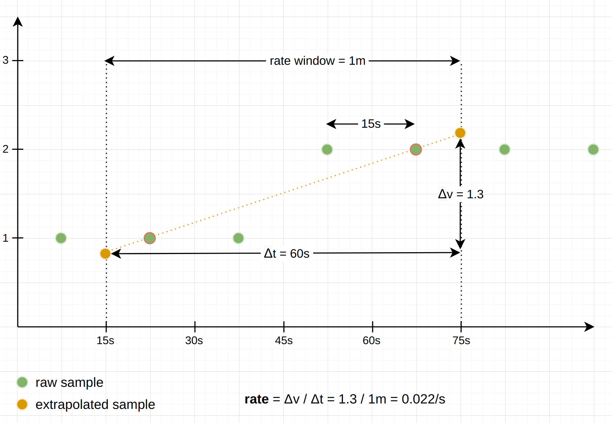

阅读本文前建议先阅读Prometheus官方文档，了解基础概念和使用
## 什么是promQL
如何分析时序指标数据呢？Prometheus给出的解决方案是promQL。
PromQL是Prometheus监控系统的查询语言。它是 Prometheus 的一项核心功能，可以对收集的**时间序列数据**进行仪表板、警报和查询，所有这些都基于同一系统中的一种统一语言。PromQL 允许您选择、聚合和运算时间序列。


## 数据模型

### 时间序列


prometheus 的[数据模型](https://prometheus.io/docs/concepts/data_model/)

### 指标类型

prometheus 允许exporter使用四种不同的[指标类型](https://prometheus.io/docs/concepts/metric_types/)。

- Counter 只增不减，如：http请求数，cpu使用时间
- Gauge 可增可减，如：温度，内存使用量，磁盘使用量
- Histogram 对观察对象（通常是持续时间、响应大小）进行采样，通过桶计数的方式进行统计
- Summary 与Histogram类似，不同点是它计算滑动时间窗口上的可配置分位数

**和传统监控（区别于prometheus）不同的是，prometheus的指标类型没有明确的时间窗口（除Summary）概念，时间窗口是在promQL中进行运算的，这种设计简化了agent端的统计，也给promQL分析带来了灵活性，但是同时增加了promQL的复杂度**
## promQL语言

PromQL是一种嵌套函数语言，用来分析时间序列数据的一种查询语言。我们可以先看下promQL查询的结构和类型是怎么样，以及随着时间的推移如何计算时序值。
我们将了解promQL表达式的结构、表达式结果类型、表达式节点类型、查询类型和间隔。

**promQL和指标类型没有关联**
### 嵌套结构

PromQL 是一种嵌套函数式语言。这意味着您将要查找的数据描述为一组嵌套的表达式，每个表达式都作为中间值参与计算（无副作用）。每个中间值都用作其周围表达式的参数或操作数，而查询的最外层表达式表示在表、图形或类似用例中看到的最终返回值。

下面是promQL的解析结果，每行注释可以看作是一个表达式
```
# Root of the query, final result, approximates a quantile.
histogram_quantile(
  # 1st argument to histogram_quantile(), the target quantile.
  0.9,
  # 2nd argument to histogram_quantile(), an aggregated histogram.
  sum by(le, method, path) (
    # Argument to sum(), the per-second increase of a histogram over 5m.
    rate(
      # Argument to rate(), the raw histogram series over the last 5m.
      demo_api_request_duration_seconds_bucket{job="demo"}[5m]
    )
  )
)
```


PromQL 表达式不仅是整个查询，而且是查询的任何嵌套部分（如上面的部分 rate(…) ），每个嵌套的查询都可以单独运行。在上面的示例中，每个注释行表示一个表达式。

### 表达式结果类型
- 字符串 一个简单的字符串值
- 标量 一个简单的浮点值
- 即时向量 一组时间序列，每个时间序列包含一个样本，所有时间序列共享相同的时间戳
- 范围向量 一组时间序列，其中包含每个时间序列随时间变化的一系列数据点

### 表达式节点类型
我们如何写promQL表达式呢，表达式节点有下面10种类型

- aggregation 聚合(sum,min,max,avg,stddev,stdvar,count,group,count_values,bottomk,topk,quantile),聚合表达式中参数是即时向量,结果也只能是即时向量 如 sum without (instance) (http_requests_total)
- binaryExpr 二元运算符组合成多元表达式（+-*/%^==!=...） 如 http_requests_total - http_requests_error_total
- call 函数表达式（abs,absent,absent_over_time...）,参数是标量或即时向量、范围向量，返回结果目前是即时向量、标量 如 abs(http_requests_total)
- matrixSelector 范围向量选择器（无回溯、过期） 如 http_requests_total{job="job"}[1m]
- vectorSelector 向量选择器 如 http_requests_total{job="job"}
- subquery 子查询 支持指定查询范围和精度 返回范围向量 如 rate(http_requests_total[1m])[30m:1m]
- numberLiteral 数字 如 1、1e-1
- stringLiteral 字符串 如 "version"
- parenExpr 元括号 (up) 
- unaryExpr 一元表达式 -1^2
<!-- - placeholder  -->

### 查询类型和间隔
PromQL 查询中对时间的唯一引用是相对引用（例如 [5m] ，回顾 5 分钟）。那么，如何指定绝对图形时间范围或在表中显示查询结果的时间戳呢？在 PromQL 中，此类时间参数与表达式分开发送到 Prometheus 查询 API，确切的时间参数取决于您发送的查询类型。Prometheus 有两种类型的 PromQL 查询：即时查询和范围查询。

**查询时间参数和step构成了step window**
#### 即时查询
参数：
- promQL表达式
- time

即时查询主要用于检测和表格，即时查询可以返回任何有效的 PromQL 表达式类型（字符串、标量、即时和范围向量）。


#### 范围查询
范围查询主要用于图表，显示给定时间范围内的 PromQL 表达式。范围查询的工作方式与许多完全独立的即时查询完全相同，这些即时查询在给定时间范围内的后续时间步长进行计算。当然实际计算时，引擎有做优化，Prometheus实际上并没有运行许多独立的即时查询。范围查询允许传入即时向量类型或标量类型表达式，但始终返回范围向量

参数：
- promQL表达式
- start 
- end
- step

## 如何写promQL
常见promQL清单
#### 时间序列选择器
node_cpu_seconds_total 选择最近的1个样本，即时向量，默认最大回溯5分钟
```
node_cpu_seconds_total
```
node_cpu_seconds_total 选择1分钟范围内所有样本，范围向量，无回溯问题
```
node_cpu_seconds_total[1m]
```
#### 计数器增长率
5分钟内平均增长率
```
rate(container_cpu_usage_seconds_total[5m])
```
5分钟内**瞬时**增长率，计算5分钟内最后两个样本
```
irate(container_cpu_usage_seconds_total[5m])
```
与过去5分钟相比的绝对增长
```
increase(container_cpu_usage_seconds_total[5m])
```
#### 汇总多个时间序列
汇总所有序列总和
```
sum(rate(container_cpu_usage_seconds_total[5m]))
```
保留instance和job标签汇总
```
sum by(job, instance) (rate(container_cpu_usage_seconds_total[5m]))
```
汇总去instance和job标签
```
sum without(job, instance) (rate(container_cpu_usage_seconds_total[5m]))
```
#### 直方图
对于每个标签维度，过去 5 分钟内第 90 个百分位的请求延迟：
```
histogram_quantile(0.9, rate(demo_api_request_duration_seconds_bucket[5m]))
```
path 和 method 维度上，过去 5 分钟内第 90 个百分位的请求延迟
```
histogram_quantile(
  0.9,
  sum by(le, path, method) (
    rate(demo_api_request_duration_seconds_bucket[5m])
  )
)
```
#### 时间聚合
过去5分钟均值
```
avg_over_time(process_resident_memory_bytes[5m])
```
过去5分钟的样本数
```
count_over_time(process_resident_memory_bytes[5m])
```
#### 二元运算
计算当前请求率与上周之间的差异
```
rate(demo_api_request_duration_seconds_count[5m] offset 1w) - rate(demo_api_request_duration_seconds_count[5m])
```
#### 子查询
按照step=10s获取过去1小时内的最大速率
```
max_over_time(
  rate(
    demo_api_request_duration_seconds_count[5m]
  )[1h:10s]
)
```
### 常见函数说明

#### rate、irate、increase
- rate()：这计算每秒的增长率，在整个提供的时间窗口内平均。示例：rate(http_requests_total[5m])生成 5 分钟时间窗口内平均的每秒 HTTP 请求速率。此函数是最常见的，因为它产生具有可预测的每秒输出单位的良好平滑速率。
- irate()（“即时速率”）：这与rate类似，计算每秒的增长率rate()，但仅考虑提供的时间窗口下的最后两个样本进行计算，并忽略所有较早的样本。示例：irate(http_requests_total[5m])查看提供的 5 分钟窗口下的最后两个样本，并计算它们之间的每秒增长率。如果您想让放大的图表显示对速率变化的快速响应，则此函数会很有帮助，但输出会比rate()尖锐很多。
- increase()：此函数与rate完全相同，只是rate()它不将最终单位转换为“每秒”( 1/s)。相反，最终的输出单位是每个提供的时间窗口。示例：increase(http_requests_total[5m])得出 5 分钟窗口内处理的 HTTP 请求的总增量（单位：/5m)。因此increase(foo[5m]) / (5 * 60)相当于rate(foo[5m])。

所有三个函数都要求在提供的范围窗口下至少需要两个样本才能工作。窗口下样本少于两个的序列将从结果中删除。在给定固定的时间窗口和属于该窗口下的一些数据点的情况下，如何准确计算增长率是一个权衡和不完美的近似问题。下面看下prometheus是如何做的：

#### 数据点外推
仔细观察下图，由于promQL查询语法，query time 和range duration产生的rate time window不可能和实际的data point第一个和最后一个点重合，所以计算increase(foo[1m])）会产生一个估算问题，将窗口下的第一个和最后一个数据点之间的斜率外推到窗口边界，以获得平均更接近整个窗口的预期增量的值（如果实际上在窗口边界精确存在样本） 。



- **窗口外推存在限制，rate() 和 increase() 第一个或最后一个样本远离其各自的窗口边界超过窗口下样本之间平均间隔的 1.1 倍时，函数猜测序列在窗口下开始或结束。在这种情况下，外推法仅将平均样本间隔的一半延伸到窗口边界**
- **第一个值在外推到0时即停止外推，计数器总是从0值开始，并且永远不会为负值**

#### 计数器复位
计数器通常只会上升，但它们会在跟踪它们的进程重新启动时重置。为了避免将这些重置计算为负速率，函数在时间窗口下迭代样本时，函数会检查是否有任何样本的值低于前一个样本，并将这种情况解释为计数器重置。这些函数只需将新的样本值添加到之前看到的样本值中，以补偿重置。


``` go
// /usr/bin/env go
// prometheus 2.37.8 promql/functions.go
// extrapolatedRate is a utility function for rate/increase/delta.
// It calculates the rate (allowing for counter resets if isCounter is true),
// extrapolates if the first/last sample is close to the boundary, and returns
// the result as either per-second (if isRate is true) or overall.
func extrapolatedRate(vals []parser.Value, args parser.Expressions, enh *EvalNodeHelper, isCounter, isRate bool) Vector {
	ms := args[0].(*parser.MatrixSelector)
	vs := ms.VectorSelector.(*parser.VectorSelector)
	var (
		samples    = vals[0].(Matrix)[0]
		rangeStart = enh.Ts - durationMilliseconds(ms.Range+vs.Offset)
		rangeEnd   = enh.Ts - durationMilliseconds(vs.Offset)
	)

	// No sense in trying to compute a rate without at least two points. Drop
	// this Vector element.
	if len(samples.Points) < 2 {
		return enh.Out
	}

	resultValue := samples.Points[len(samples.Points)-1].V - samples.Points[0].V
	if isCounter {
		var lastValue float64
		for _, sample := range samples.Points {
			if sample.V < lastValue {
				resultValue += lastValue
			}
			lastValue = sample.V
		}
	}

	// Duration between first/last samples and boundary of range.
	durationToStart := float64(samples.Points[0].T-rangeStart) / 1000
	durationToEnd := float64(rangeEnd-samples.Points[len(samples.Points)-1].T) / 1000

	sampledInterval := float64(samples.Points[len(samples.Points)-1].T-samples.Points[0].T) / 1000
	averageDurationBetweenSamples := sampledInterval / float64(len(samples.Points)-1)

	if isCounter && resultValue > 0 && samples.Points[0].V >= 0 {
		// Counters cannot be negative. If we have any slope at
		// all (i.e. resultValue went up), we can extrapolate
		// the zero point of the counter. If the duration to the
		// zero point is shorter than the durationToStart, we
		// take the zero point as the start of the series,
		// thereby avoiding extrapolation to negative counter
		// values.
		durationToZero := sampledInterval * (samples.Points[0].V / resultValue)
		if durationToZero < durationToStart {
			durationToStart = durationToZero
		}
	}

	// If the first/last samples are close to the boundaries of the range,
	// extrapolate the result. This is as we expect that another sample
	// will exist given the spacing between samples we've seen thus far,
	// with an allowance for noise.
	extrapolationThreshold := averageDurationBetweenSamples * 1.1
	extrapolateToInterval := sampledInterval

	if durationToStart < extrapolationThreshold {
		extrapolateToInterval += durationToStart
	} else {
		extrapolateToInterval += averageDurationBetweenSamples / 2
	}
	if durationToEnd < extrapolationThreshold {
		extrapolateToInterval += durationToEnd
	} else {
		extrapolateToInterval += averageDurationBetweenSamples / 2
	}
	resultValue = resultValue * (extrapolateToInterval / sampledInterval)
	if isRate {
		resultValue = resultValue / ms.Range.Seconds()
	}

	return append(enh.Out, Sample{
		Point: Point{V: resultValue},
	})
}
```
### 执行过程分析 
对一个简单的promQL来分析，它的执行过程大致分为以下几步：
```
SUM BY (group) (http_requests{job="api-server",group="production"}) 
```

- 进行语法分析（prometheus采用LL语法分析）,promQL会转化成AST树结构。语法解析文件[promQL.g4](https://github.com/antlr/grammars-v4/blob/master/promql/PromQLLexer.g4)

- 通过vistor模式遍历语法树
``` go
// Walk traverses an AST in depth-first order: It starts by calling
// v.Visit(node, path); node must not be nil. If the visitor w returned by
// v.Visit(node, path) is not nil and the visitor returns no error, Walk is
// invoked recursively with visitor w for each of the non-nil children of node,
// followed by a call of w.Visit(nil), returning an error
// As the tree is descended the path of previous nodes is provided.
func Walk(v Visitor, node Node, path []Node) error {
	var err error
	if v, err = v.Visit(node, path); v == nil || err != nil {
		return err
	}
	path = append(path, node)

	for _, e := range Children(node) {
		if err := Walk(v, e, path); err != nil {
			return err
		}
	}

	_, err = v.Visit(nil, nil)
	return err
}

type inspector func(Node, []Node) error

func (f inspector) Visit(node Node, path []Node) (Visitor, error) {
	if err := f(node, path); err != nil {
		return nil, err
	}

	return f, nil
}
```
- 表达式求值（select->block->labelMathchers->refid(tsid)->chunk03）
**表达式求值是整个引擎实现最为复杂的部分，这里仅描述整体流程，具体实现细节不展开（并行计算、算子下推（时间序列选择、时间序列聚合、时间聚合、其他函数算子））**
``` go
func (ng *Engine) populateSeries(querier storage.Querier, s *parser.EvalStmt) {
	// Whenever a MatrixSelector is evaluated, evalRange is set to the corresponding range.
	// The evaluation of the VectorSelector inside then evaluates the given range and unsets
	// the variable.
	var evalRange time.Duration

	parser.Inspect(s.Expr, func(node parser.Node, path []parser.Node) error {
		switch n := node.(type) {
		case *parser.VectorSelector:
			start, end := ng.getTimeRangesForSelector(s, n, path, evalRange)
			hints := &storage.SelectHints{
				Start: start,
				End:   end,
				Step:  durationMilliseconds(s.Interval),
				Range: durationMilliseconds(evalRange),
				Func:  extractFuncFromPath(path),
			}
			evalRange = 0
			hints.By, hints.Grouping = extractGroupsFromPath(path)
			n.UnexpandedSeriesSet = querier.Select(false, hints, n.LabelMatchers...)

		case *parser.MatrixSelector:
			evalRange = n.Range
		}
		return nil
	})
}
```
``` go
// block query 
func (q *blockQuerier) Select(sortSeries bool, hints *storage.SelectHints, ms ...*labels.Matcher) storage.SeriesSet {
	mint := q.mint
	maxt := q.maxt
	disableTrimming := false

	p, err := PostingsForMatchers(q.index, ms...)
	if err != nil {
		return storage.ErrSeriesSet(err)
	}
	if sortSeries {
		p = q.index.SortedPostings(p)
	}

	if hints != nil {
		mint = hints.Start
		maxt = hints.End
		disableTrimming = hints.DisableTrimming
		if hints.Func == "series" {
			// When you're only looking up metadata (for example series API), you don't need to load any chunks.
			return newBlockSeriesSet(q.index, newNopChunkReader(), q.tombstones, p, mint, maxt, disableTrimming)
		}
	}

	return newBlockSeriesSet(q.index, q.chunks, q.tombstones, p, mint, maxt, disableTrimming)
}
```
### promQL优化
promQL查询慢常见原因
- 选择大量时间序列
- 选择大量原始样本
- 个别标签过滤器匹配大量的时间序列
- 函数运算复杂度高

promQL 查询开销取决于查询语句和查询的数据，在做优化时主要也围绕着上面四点进行，查询缩短时间范围、增加过滤标签、减少方括号中回溯窗口大小、增加查询的分辨率step，都是常见的一些方法。常见的tsdb也会提供一些工具如日志，来确定查询缓慢的promQL。


#### 引用
[Metric Types in Prometheus and PromQL](https://promlabs.com/blog/2020/09/25/metric-types-in-prometheus-and-promql/)

[The Anatomy of a PromQL Query
](https://promlabs.com/blog/2020/06/18/the-anatomy-of-a-promql-query/)

[Selecting Data in PromQL
](https://promlabs.com/blog/2020/07/02/selecting-data-in-promql/)

[QUERYING PROMETHEUS
](https://prometheus.io/docs/prometheus/latest/querying/basics/#querying-prometheus)

[promlens](https://github.com/prometheus/promlens)

[prometheus](https://github.com/prometheus/prometheus)

[antlr v4](https://github.com/qijun/grammars-v4/blob/master/promql/PromQLParser.g4)

[promQL optimize](https://flashcat.cloud/blog/how-to-optimize-promql-and-metricsql-queries/)